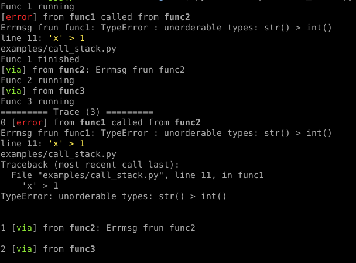

# Goerr

Go style explicit error handling in Python. Features:

  - **Pretty print** of error details  
  - **Trace** errors across the call stack  
  - **Log** errors  
  - **Test** errors

   ```bash
   pip install goerr
   ```
[Documentation](https://synw.github.io/goerr/)

## API

### Class **`Err`**

#### Methods:

**`err`**: creates a new error, print it and store it in the trace if the option is activated. Exit the program
if the trace is not activated. Parameters: 

- `ex`: an exception (optional)
- `msg`: the message string (optional)
Either a message string or an exception has to be provided as argument for the error to be
printed. If no argument is provided it will just record the function name to keep a trace of
the call stack

**`warning`**: prints a warning message

**`info`**: prints an info message

**`debug`**: prints a debug message

**`panic`**: force program exit after an error even if the errors trace is activated

**`to_dict`**: returns a dictionnary with the error details 

### Class **`Log`**

Same as  `Err` but log errors

#### Properties

**`log_path`**: path of the file where to log. Default is `"errors.log"`  
**`log_format`**: csv or text. Default is `"csv"`. 
Note: the tracebacks are not recorded if the format is csv.

### Class **`Trace`**

Same as `Err` but trace errors

#### Properties

**`trace`**: prints the errors trace and reset it
**`via`**: same as `err` with an empty error: to record the call stack. See example

## Example

Check the [examples](./examples) directory for code

Trace errors across the call stack:

```python
import time
from goerr import Trace

err = Trace()

def func1():
    print("Func 1 running")
    time.sleep(0.5)
    try:
        'x' > 1
    except Exception as e:
        err.new("Errmsg frun func1", e)
    print("Func 1 finished")

def func2():
    func1()
    time.sleep(0.5)
    err.via("Errmsg frun func2")
    print("Func 2 running")
       
def func3():
    func2()
    time.sleep(0.5)
    err.via()
    print("Func 3 running")
        
func3()
err.trace()
```

Output:



## Testing errors in programs

A helper function is available to test errors:

**`testing.assert_err`**: parameters: 

- `error type`: a string with the error type
- `function to run`: the function to test
- `*args`: function arguments
- `**kwargs`: function keyword arguments

Example:

```python
# the program
from goerr import Err
   
   class Foo(Err):
      def func1(self, param1, param2):
          try:
              param1 > param2
          except Exception as e:
              self.err(e)

# the test
import unittest
from goerr.testing import assert_err
from myprogram import Foo

   class MyTest(unittest.TestCase):
	  def test_myprogram(self):
          foo = Foo()
          assert_err("TypeError", foo.func1, 1, "bar")
```

## Why?

I like the explicit errors management in Go (unlike many people) and I wanted to have the
same kind of experience in Python: a fined grained control over errors all across the call
stack.

The same lib in Go: [terr](https://github.com/synw/terr)
