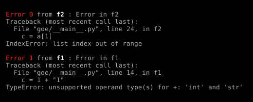

# Goerr

Go style explicit error handling in Python. Propagates errors up the call stack in the same style as Go.

   ```bash
   pip install goerr
   ```

## Quick example

   ```python
    from goerr import Trace
    
    
    class TestErr(Trace):

       def func1(self):
          msg("Function 1 running")
          self.output("function 1")
          try:
             "a" > 1
          except Exception as e:
             self.err(e)

       def func2(self):
          msg("Function 2 running")
          self.output("function 2")
          self.err("An error has occured")

       def run(self):
          self.func1()
          self.func2()
          self.stack()

       def output(self, msg, i=3):
          while i > 0:
             print(msg)
             i -= 1

te = TestErr()
te.run()
msg("### Log msg:")
log_msg = te.log()
print(log_msg)
msg("### Full trace:")
te.check()
   ```

Output:



## API

### Methods:

**`err`**: creates a new error and store it in the trace: parameters: 

- `ex`: an exception (optional)
- `msg`: the message string (optional)
Either a message string or an exception has to be provided as argument.

**`trace`**: prints the errors trace

**`check`**: check if error exists and run `trace()` if it does

**`fatal`**: check if error exists, run `trace()` if it does and raise an exception

**`stack`**: add an error to the trace with no message if one previous error exists. Used
to keep track of the call stack

**`log`**: returns a log message from the first error

### Properties:

**`exists`**: check if there are some errors in the trace. Returns `True` or `False`

## Why?

I like the explicit errors management in Go (unlike many people) and I wanted to have the
same kind of experience in Python: a fined grained control over errors all across the call
stack.

The same lib in Go: [terr](https://github.com/synw/terr)